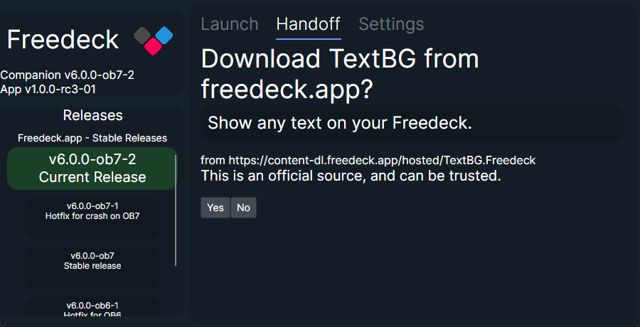

# Freedeck App

## NOT TO BE CONFUSED WITH [THE ACTUAL FREEDECK APP](https://github.com/freedeck/freedeck)

This is the all-in-one solution to installing and using Freedeck.  

This app is an installer AND launcher all together! It will also eventually BE Handoff.

Made with Avalonia and .NET 8.0.

## Screenshots
These may not be up-to-date as the UI continues to evolve.  

## Installation: Setup

## Launch Tab

## Settings Tab

## Handoff Plugin Download Request

## Features

- Simple user interface using Avalonia
- Installs Freedeck
- Handles the `freedeck://` URL protocol
- Can migrate from old launcher
- Actually can handle other installation directories
- Autoupdater is more refined
- As a plus, the code is also so much better

## Handoff - URL Protocol
[You may see the original specs here, but they are totally different now.](https://github.com/Freedeck/handoff)

The launcher must be at least running for these to work (right now). This will be changed later.  
Any request looks like this:  
`freedeck://ACTION/Argument1/Argument2`

### Handoff: Downloading Plugins
To download any plugin using the App, you must specify:
- the `download` command
- the plugin ID
- the plugin URL (URL encoded, ex: " " turns into "%20")
- the plugin description
- the repository's title

This is very easy to do, here's the scheme: `freedeck://download/ID/URL/Description/RepositoryTitle`  

An example, using [TextBG](https://github.com/Freedeck/TextBG)
`freedeck://download/TextBG/https%3A%2F%2Fcontent-dl.freedeck.app%2Fhosted%2FTextBG.Freedeck/Show%20any%20text%20on%20your%20Freedeck./freedeck.app`

### Handoff: Updating plugins
Updating uses the same idea as downloading them, except instead of `download` as the command, it's update.

An example, using [TextBG](https://github.com/Freedeck/TextBG)
`freedeck://update/TextBG/https%3A%2F%2Fcontent-dl.freedeck.app%2Fhosted%2FTextBG.Freedeck/Show%20any%20text%20on%20your%20Freedeck./freedeck.app`

## Using

When the App becomes stable, it'll be what you download from [freedeck.app](https://freedeck.app). For now, it'll be only on GitHub releases.

## Building

To make a release-ready build, just run `dotnet publish` in your console.
Or, if you like the GUI way (JetBrains Rider only), right click on the project, click Publish then "Freedeck New Release". 