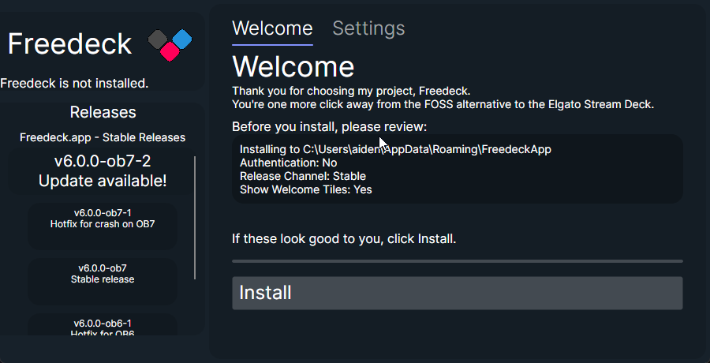
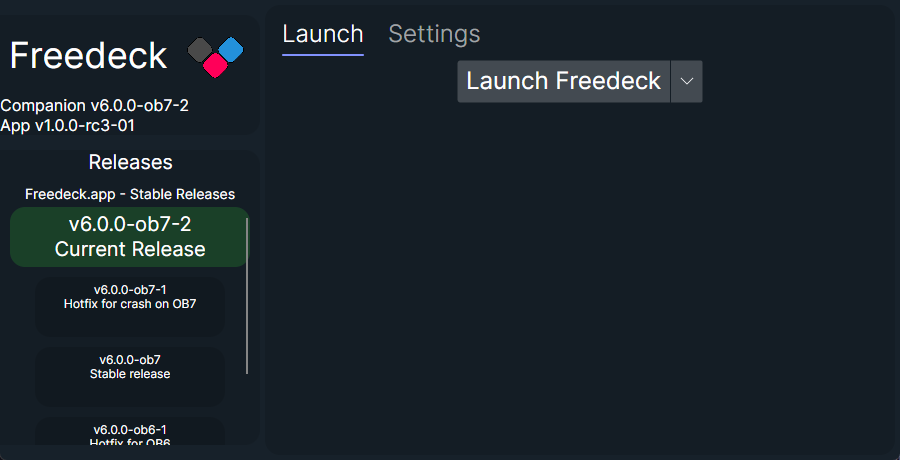
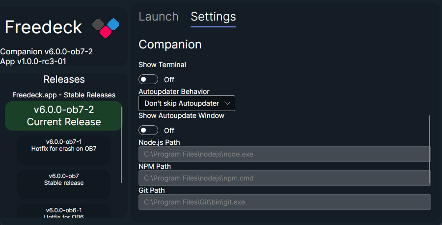

# Freedeck App

## NOT TO BE CONFUSED WITH [THE ACTUAL FREEDECK APP](https://github.com/freedeck/freedeck)

This is the all-in-one solution to installing and using Freedeck.  

This app is an installer AND launcher all together! It will also eventually BE Handoff.

Made with Avalonia and .NET 8.0.

## Screenshots
These may not be up-to-date as the UI continues to evolve.  

## Installation: Setup

## Launch Tab

## Settings Tab

## Features

- Simple user interface using Avalonia
- Installs Freedeck
- Can migrate from old launcher
- Actually can handle other installation directories
- Autoupdater is more refined
- As a plus, the code is also so much better

## Using

When the App becomes stable, it'll be what you download from [freedeck.app](https://freedeck.app). For now, it'll be only on GitHub releases.

## Building

To make a release-ready build, just run `dotnet publish` in your console.